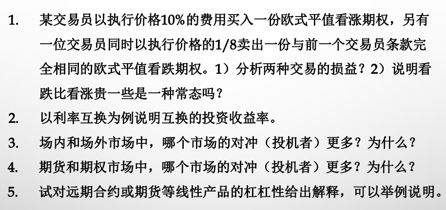

# 衍生品研究作业1

## 论述题

1. 1)

   | 情况  | 第一个交易员（买入看涨期权） | 第二个交易员（卖出看跌期权）损益 |
   | ----- | ---------------------------- | :------------------------------- |
   | St≥K | (St-K)-0.1K = St-1.1K | 0.125K                           |
   | St<K  | −0.1K                       | St−K+0.125K =  St -0.875K |

   2)不一定，一般来说，看涨期权可能会更贵

   

2. 为说明互换的投资收益率我们先进行一些假设

- 假设条件
    - 名义本金（Notional Principal）为 $NP$。
    - 固定利率（Fixed Rate）为 $R_{fixed} $。
    - 支付日期为 $t_1, t_2, \ldots, t_n$，其中 $t_i $ 表示第 $i$ 个支付时间点。
    - 支付间隔为$ \Delta t$（例如，如果每年支付一次，则$ \Delta t = 1$ 年）。
    - 浮动利率序列：在每个支付期初设定浮动利率，期末支付。设浮动利率在时间$ t_{i-1}$ 设定为$ R_{float}(t_{i-1})$，则在支付日期$ t_i$ 的浮动利率支付基于$ R_{float}(t_{i-1})$

    完成假设之后，我们进一步分析现金流
    
- 现金流分析
  
    - 固定利率支付方在每个支付日期$ t_i$:
      - 支付固定利息:$ -R_{fixed} \times NP \times \Delta t$.
      - 接收浮动利息:$ +R_{float}(t_{i-1}) \times NP \times \Delta t$.
    - 因此，净现金流在$ t_i$ 为:
$$
  CF_i = \left[ R_{float}(t_{i-1}) - R_{fixed} \right] \times NP \times \Delta t
$$
  其中$ CF_i$ 为正表示净流入，负表示净流出。

最后我们来计算投资收益率，根据定义写出方程
$$
  \sum_{i=1}^n \frac{CF_i}{(1 + r)^{t_i}} = 0
$$
解出r即为投资收益率

3. 场内投机者更多，因为流动性更好

4. 期权市场投机者多，因为非线性产品可以带来更大杠杆与收益

5. 杠杆是使用少量资金控制了价值更大的资产。 远期或期货合约的杠杆性是由于保证金制度， 在10%保证金的情况下， 用100w即可控制1000w的资产

